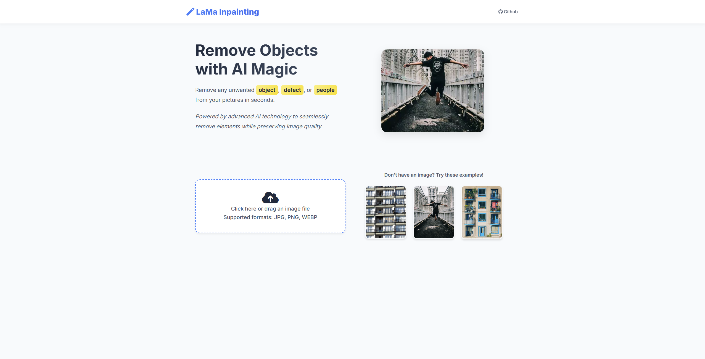

# Simple-LaMa-Inpainting

🎨 **Simple-LaMa-Inpainting** là một project demo sử dụng mô hình **LaMa (Large Mask Inpainting)** để thực hiện bài toán *image inpainting* — khôi phục các vùng bị che khuất trong ảnh một cách tự nhiên và nhất quán.

Project được xây dựng với mục tiêu:

* Dễ cài đặt
* Dễ chạy
* Sử dụng pretrained model (Simple LaMa)
* Có giao diện web đơn giản để demo trực tiếp

---

## 🚀 Demo

Sau khi chạy thành công, bạn có thể truy cập:

```
http://localhost:5000
```

để tải ảnh lên và trải nghiệm khả năng inpainting của mô hình LaMa.



---

## 📁 Cấu trúc thư mục (rút gọn)

```
Simple-LaMa-Inpainting/
│
├── LaMa_models/
│   └── big-lama/
│       └── models/
│           └── best.ckpt        # Pretrained checkpoint
│
├── run.py                       # File chạy web app
├── requirements.txt
├── README.md
└── ...
```

---

## ⚙️ Cài đặt & Hướng dẫn chạy

### 1️⃣ Clone repository

```bash
git clone https://github.com/your-username/Simple-LaMa-Inpainting.git
cd Simple-LaMa-Inpainting
```

---

### 2️⃣ Tạo môi trường ảo (khuyến nghị)

```bash
python -m venv venv
```

Kích hoạt môi trường ảo:

* **Linux / macOS**

```bash
source venv/bin/activate
```

* **Windows**

```bash
venv\Scripts\activate
```

---

### 3️⃣ Cài đặt các thư viện cần thiết

```bash
pip install -r requirements.txt
```

---

### 4️⃣ Tải pretrained model (best.ckpt)

Tải file **best.ckpt** tại link sau:

👉 [https://drive.google.com/drive/folders/1fRaAtVEwugbDMd1yjspkDpK0Ht_EOnF5?usp=sharing](https://drive.google.com/drive/folders/1fRaAtVEwugbDMd1yjspkDpK0Ht_EOnF5?usp=sharing)

Sau khi tải xong, đặt file vào đúng thư mục:

```
LaMa_models/big-lama/models/best.ckpt
```

⚠️ **Lưu ý:** Đường dẫn và tên file phải đúng để chương trình nhận diện được model.

---

### 5️⃣ Chạy ứng dụng

```bash
python run.py
```

Nếu không có lỗi, terminal sẽ hiển thị thông báo server đang chạy.

---

### 6️⃣ Truy cập web demo

Mở trình duyệt và vào:

```
http://localhost:5000
```

---

## 🧠 Về mô hình LaMa

LaMa (Large Mask Inpainting) là một phương pháp inpainting hiện đại sử dụng **Fast Fourier Convolution (FFC)**, cho phép:

* Trường cảm thụ toàn ảnh
* Hoạt động tốt với vùng mask lớn
* Tổng quát hóa tốt lên ảnh độ phân giải cao dù chỉ train ở 256×256

📄 Paper: *Resolution-robust Large Mask Inpainting with Fourier Convolutions*

---

## 📌 Ghi chú

* Project phục vụ mục đích **demo và học tập**
* Không tối ưu cho production
* Có thể cần GPU để chạy nhanh hơn (CPU vẫn chạy được nhưng chậm)

---

## 🙌 Acknowledgements

* LaMa authors: [https://github.com/saic-mdal/lama](https://github.com/saic-mdal/lama)
* Pretrained Big LaMa model từ nhóm tác giả gốc

---

## ⭐ Nếu thấy hữu ích

Đừng quên để lại một ⭐ cho repository nhé!

